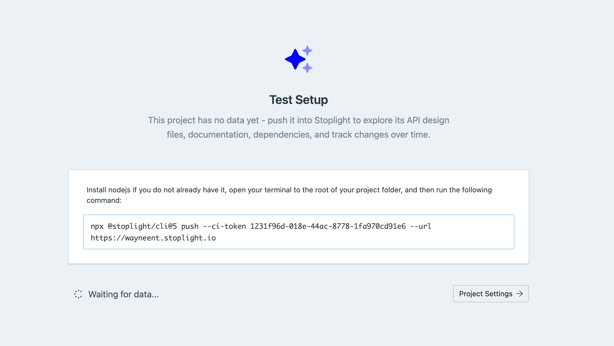
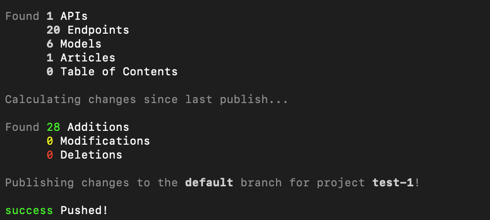

## Stoplight CLI

Another point of entry into the Stoplight Universe, is through the **Stoplight CLI**. 

## What is Stoplight CLI?

Stoplight CLI is a command-line tool, built as an NPM module, which can publish changes to Stoplight, and have them show up in Explorer just like any other project. 

**Stoplight CLI** is designed for those who use a different version control system other than Git. 

If you make use of Mercurial, SVN, SourceSafe, Bazaar or another service to keep your work organized, Stoplight has you covered.

> ** 👉 Note:** Projects you add through CLI ****won't be editable in Studio, but the content will be available to read and search like anything else. 

1. Navigate to the **Add Projects** section and click on via **Stoplight CLI.**
2. Give this project a name, and click **Add Project**. This is going to create an empty project where you can  push data.
3. Copy the **command** on the screen.

4.  Open your terminal, navigate to the root folder of the project and **run this command**. This will push data to your workspace. 

5. You can then view the project in our **Explorer.**

## What's Next:

Now that your project is into Stoplight, it's really important you promote it to Git to enable collaborations. Read on to learn how to: 

- **[Working with Local Projects](../8.-projects/Local-Projects.md)**
- **[Configure Git](../9.-git-management/configure-git)**
- **[Share Project](../1.-quickstarts/share-documentation-quickstart.md)**