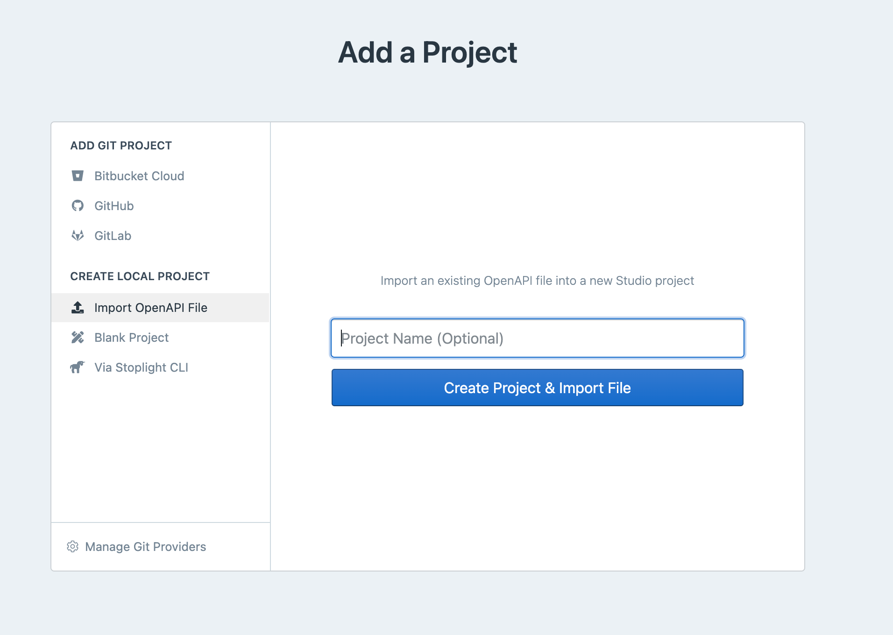
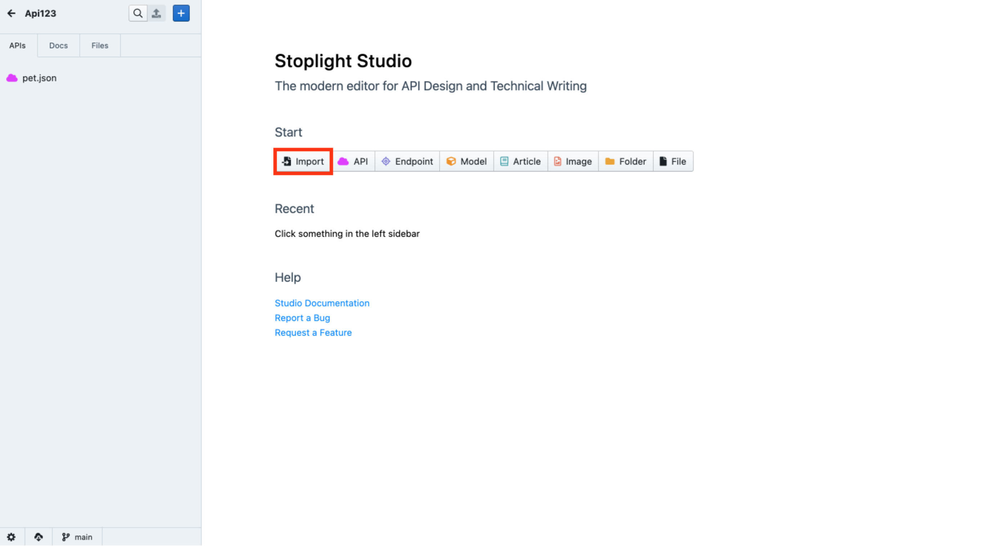

# Import OpenAPI File

While the ideal way to **add** and **sync** your **projects** with Stoplight is via **Git**, it's not the only way to get your files into the system. 

Incase you need to override an existing file, or add a new OpenAPI file to your project (that does not exist on your repo), you can easily upload it from your local storage. 

Additionally, if your projects does not exist on Git at all, you can also import an OpenAPI project to get started. 

## What is **OpenAPI?**

OpenAPI (formerly Swagger Specification) is an is an API description format for REST APIs. With an OpenAPI file you can describe your entire API before you build it. It's your point of entry into the Stoplight universe. 

An OpenAPI file includes:

- Available endpoints and operations on each endpoint
- Parameters for each operation
- Authentication methods
- Contact information, license, terms of use and other information.

> **👉 Note:** Stoplight accepts **OpenAPI V2** , **V3** and **JSON Schemas.**

## Importing OpenAPI Spec on Stoplight

### Creating a new Project:

If you are starting off from scratch and your project does not exist on Git at all: 

1. From your dashboard, click the **+** (add projects) on the left top corner. 
2. Navigate to **Import OpenAPI** F**ile** on the Add project page. 

  2. Specify a **Name** for the project. 

  3. Choose the **project folder** from local storage. 

  4. Clicking upload/open according to your file system. 

**It's that simple. Your Project is now on Stoplight, you can now start editing your API.** 

> ** ⚠️ Warning:** Projects that are created locally need to be promoted to Git, or all progress will be lost after the browser session ends. 

### **Adding an OpenAPI File:**

If your project already exists on Stoplight, and you want to add a new **OpenAPI file** to the project: 

1. Select your project from your workspace home screen and click the **Edit** button. 
2.  This will open the **Stoplight Studio.** 
3. On the studio homepage, select I**mport**. 

4. Chose the file from your local storage. 

**And that's it. Your OpenAPI file is now on Stoplight.** 

**What's Next:** 

Now that your OpenAPI file is on Stoplight, the first thing you need to do is push updates to Git. Once done you can start editing the file or share is as documentation. Read on to lear how: 

- **[Share Documentation](https://meta.stoplight.io/docs/platform/1.-quickstarts/share-documentation-quickstart.md)**
- **[Start designing with Stoplight](https://meta.stoplight.io/docs/platform/3.-design/a.overview.md)**