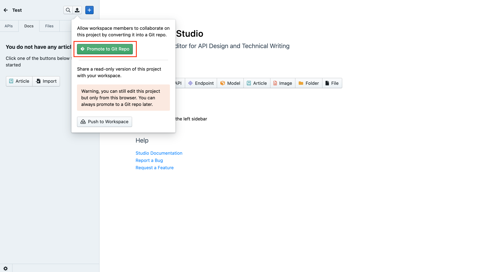
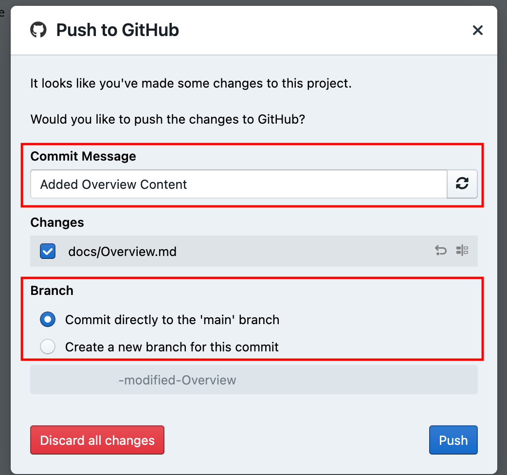

# Publish Changes

If your project on Stoplight is not associated with a Git repository, you can only edit it on your browser (or the Studio desktop app), and can potentially lose the ability to edit your content if your data is lost. 

We recommend that you always **promote your projects to Git**, no matter what way you chose to add them on Stoplight. 

Once the project is on Git, you can start collaborating on it with your team members. 

## Promoting projects to Git

When you create a new blank project on stoplight, you are instantly taken to **Studio,** our editor for **API design** and **documentation.** Once you are on Studio: 

1. Click the **push** button on the top left corner. 
2. This will open a pop-up that will ask you to either **promote project to Git** or push to workspace. Click the **Promote to Git Repo** button. 

3. Next specify your **Git provider**, **Organization, Repo Name**, and then click **Create Git Repository.**

**Your project is now on a Git repo. You can now start making edits, and share it with your team members and users. 🤝**

> **👉 Tip:** If you do not have your Git account connected with your workspace, visit this guide to find out how: **Connected Accounts**

## Pushing Changes

After making any changes within Studio, please ensure you **push** them to avoid any work being lost. To do that: 

1. Again click the **Push** button on top left corner. 
2. Add in a **Commit Message** and specify **a Branch Name.** 

3. You can also compare changes made to the project. 

5. Once done, click **Push.** 

**All of your progress and edits are now live on your Git repo! 🙌**

## Pushing to Workspace

If you don't want to push your project or content to a Git repo, you can push it to the workspace to start sharing it immediately. Projects uploaded on your workspace are just read only and can also be viewed by your team members. To do that: 

1. Click the Push icon, and then click **Push to Workspace** to use this option.

 2.  After making any changes, click **Push** again, and then click **Push to workspace** to save changes. 

> **⚠️ Warning:**  Projects not connected to a Git repository will only be editable on your current browser session. This means that you could potentially lose the ability to edit your project should you lose your session data.

**What's Next:** 

Now that your projects are connected to your Git Repo or shared on your workspace, you can share your project with your team members, and start working on your API. Read on to discover next steps: 

- **[Share your Project](../1.-quickstarts/share-documentation-quickstart.md)**
- **[Add Team members](../9.-teams/d.inviting-your-team.md)**
- **[Start designing with Stoplight Studio](../3.-design/a.overview.md)**